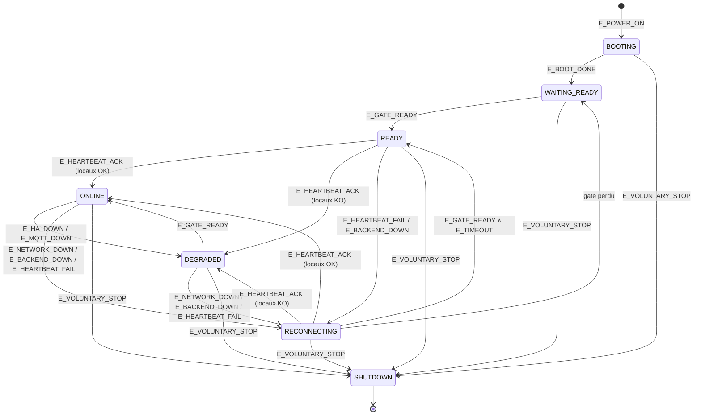

# AUTO-001 — Spécification d’architecture : reconnexion autonome nœud ↔ serveur

| Attribut | Valeur |
|----------|--------|
| **Lot** | AUTO-001 |
| **Nature** | Spécification d’architecture (normative) |
| **Statut** | **TERMINÉ / VALIDÉ** terrain (2026-07-27) — Phase 1 (A–E) + AUTO-001F 1ʳᵉ étape ; suivi : [`../backlog/execution/AUTO-001.md`](../backlog/execution/AUTO-001.md) |
| **Implémentation** | Hors périmètre de ce document |
| **Revue d’architecture** | [`AUTO-001-revue-architecture.md`](AUTO-001-revue-architecture.md) (gate, identité, remplacement, backup — avant lots A–F) |
| **Dépôts concernés** | `hestia-agent`, `hestia`, `hestia-installer`, `hestia-docs` |
| **Alignement** | ADR-018 (passerelle autonome) · EPIC-011 (admin distante, amorcé) |
| **Jalons roadmap** | Inchangés (J1, J2, …) — AUTO-001 n’est **pas** un jalon J* |

---

## 1. Objectif et principes

### 1.1 Objectif

Après toute perturbation (coupure secteur, perte Wi‑Fi/Ethernet, indisponibilité du VPS, redémarrage de l’Agent ou des services locaux), le mini-PC doit **retrouver de lui-même** un état opérationnel et redevenir **visible et pilotable via le serveur Hestia**, sans SSH ni intervention locale.

Critère métier de succès :

```text
Administrateur → Serveur Hestia  ⇒  nœud = ONLINE (API)
                 ↑
        HTTPS sortant (Agent)
                 ↑
              mini-PC
```

« SSH disponible » est un canal de **secours diagnostic**, jamais le critère d’autonomie.

### 1.2 Principes non négociables

| # | Principe |
|---|----------|
| P1 | Le **serveur est l’autorité** de pilotage et de vérité sur l’état *observé* du nœud (`ONLINE` / `OFFLINE`). |
| P2 | L’**Agent** est responsable de **maintenir le lien** (annonce, heartbeat, retry) quelles que soient les perturbations. |
| P3 | Le canal nominal est **HTTPS sortant** Agent → Serveur. Aucune connexion entrante sur le mini-PC. Les commandes Phase 2 sont **pollées** dans la réponse heartbeat (pas de push serveur → Agent). |
| P4 | Pas d’annonce `ONLINE` tant que les **services essentiels locaux** exigés par la conf ne sont pas prêts (gate Ready). |
| P5 | Retry **infini** vers le serveur (borné en délai, pas en nombre). Le nœud ne « abandonne » jamais. |
| P6 | Observabilité : tout cycle de vie doit être **reconstructible** depuis les journaux Agent (+ état API serveur). |

### 1.3 Deux plans d’état (à ne pas confondre)

| Plan | Qui | Rôle |
|------|-----|------|
| **FSM Agent** | Processus `hestia-agent` | Machine d’états locale explicite (cycle de vie). |
| **Vue Serveur** | API / registre nœud | Projection dérivée : `ONLINE` si `now - last_seen ≤ TTL`, sinon `OFFLINE`. |

Le serveur **ne simule pas** toute la FSM Agent. Il stocke le dernier snapshot et calcule `ONLINE`/`OFFLINE`. L’Agent **publie** assez d’information pour que l’admin comprenne la dégradation.

### 1.4 Principes d’implémentation Agent (AUTO-001B)

Ces règles sont **normatives** pour le runtime Agent :

| # | Principe | Exigence |
|---|----------|----------|
| I1 | **FSM pilotée par événements** | Les transitions sont déclenchées par des **événements nommés** (`E_BOOT_DONE`, `E_GATE_READY`, `E_HEARTBEAT_ACK`, `E_NETWORK_DOWN`, `E_BACKEND_DOWN`, `E_BACKEND_UP`, `E_TIMEOUT`, …). L’implémentation évalue / émet des événements puis applique `(état, événement) → nouvel état`. **Interdit** : piloter le cycle de vie uniquement par une cascade de `if` imbriqués sans table/événements explicites. |
| I2 | **Boucle principale unique** | Un seul cycle daemon Agent appelle périodiquement `presence_tick` (avec mqtt/ha/sync…). Temporisations = échéances (`next_at`) évaluées dans ce tick — **pas** de timers / sous-processus concurrents dédiés à la présence. |
| I3 | **Temporisations configurables distinctes** | `NODE_HEARTBEAT_SEC` (ONLINE/DEGRADED), `READY_RETRY_SEC` (WAITING_READY), `RECONNECT_RETRY_SEC` (RECONNECTING / échec annonce). Défauts autorisés ; **aucune** constante magique hors résolution de défaut documentée. Prépare AUTO-001C (OPS). |

---

## 2. Périmètre

### 2.1 Inclus (Phase 1 — présence)

- Cycle de vie Agent (états, événements, transitions).
- Gate Ready (réseau + services essentiels).
- Annonce / enregistrement logique via premier heartbeat réussi.
- Heartbeat périodique enrichi + snapshot santé.
- Vue serveur `ONLINE` / `OFFLINE` + TTL.
- Stratégie de reconnexion (backoff).
- Exigences de logs cycle de vie.
- Mode dégradé local (comportement Agent).

### 2.2 Phase 2 — inclus (AUTO-001F, première étape)

- Remise d’**une** commande active par nœud via `commands[]` dans la réponse heartbeat.
- Exécution Agent **idempotente** + remontée `command_report` (début / fin).
- Types sûrs uniquement : `noop`, `ping`, `reload_configuration`, `health_snapshot` (détail §16).

### 2.3 Exclus (lots futurs — hors AUTO-001F)

- File multi-commandes / priorité / orchestration complexe.
- Commandes dangereuses : `reboot`, `update`, `shutdown`, `shell`, `docker`, `systemctl`, scripts arbitraires.
- Update Agent / OPS distant déclenché par le serveur.
- Token d’auth **par** nœud (multi-nœuds strict) — extension point réservé.
- UI Admin « nœuds ONLINE ».
- Remplacement de SSH comme outil de diagnostic (SSH reste secours).

---

## 3. États retenus (FSM Agent)

### 3.1 États écartés (exemples initiaux non retenus tels quels)

| Exemple proposé | Décision | Motif |
|-----------------|----------|-------|
| `BACKEND_DISCOVERY` | **Non** | L’URL backend est **configurée** (`BACKEND_URL`), pas découverte dynamiquement en V1. |
| `REGISTERING` distinct de `AUTHENTICATING` | **Fusionné** | Un seul `POST /heartbeat` authentifié réalise auth + upsert registre. Séparer en deux états FSM n’apporte pas de transition utile. |
| `OFFLINE` côté Agent | **Non (Agent)** | Côté Agent on reste en `RECONNECTING` tant que le processus tourne. `OFFLINE` est une **vue serveur**. |
| `DEGRADED` sans sous-causes | **Oui, mais avec flags** | Un seul état FSM + snapshot `services` / `health` pour éviter une explosion d’états. |

### 3.2 États nécessaires (AUTO-001B)

Simplification opérationnelle (réseau + gate fusionnés en attente Ready ; annonce = état `READY`) :

```text
START
  → BOOTING
  → WAITING_READY     (réseau + essentiels conf effective)
  → READY             (gate OK — annonce / heartbeat en cours)
  → ONLINE
  → DEGRADED          (lien OK, locaux partiels)
  → RECONNECTING      (lien serveur / réseau perdu)
  → SHUTDOWN
```

| Ancien nom (brouillon) | Nom retenu |
|------------------------|------------|
| `NETWORK_WAIT` + `LOCAL_READY_WAIT` | `WAITING_READY` |
| `BACKEND_CONNECTING` | `READY` |

`INACTIVE` = présence non configurée (hors FSM métier).

Événements d’auth/annonce : logs (`Authentication successful`, `Node registered`) sur `E_HEARTBEAT_ACK`, pas d’états FSM supplémentaires.

### 3.3 Fiche par état

#### `BOOTING`

| Champ | Contenu |
|-------|---------|
| **Rôle** | Démarrage Agent ; conf ; runtime. |
| **Entrée** | `E_POWER_ON` / start ; reload SIGHUP. |
| **Sortie** | Conf présence OK → `E_BOOT_DONE` → `WAITING_READY` ; sinon `INACTIVE`. |
| **Transitions** | → `WAITING_READY` ; → `SHUTDOWN` |

#### `WAITING_READY`

| Champ | Contenu |
|-------|---------|
| **Rôle** | Attendre réseau + gate Ready (conf effective) avant annonce. |
| **Essentiels** | Réseau ; MQTT si `MQTT_TOPICS` ; HA si `HA_URL` ; Z2M non bloquant ; `unknown` = pas Ready. |
| **Entrée** | `E_BOOT_DONE` ; re-gate depuis `RECONNECTING`. |
| **Sortie** | `E_GATE_READY` → `READY`. |
| **Timeout** | `READY_RETRY_SEC` (défaut **5**) via `E_TIMEOUT`. |
| **Transitions** | → `READY` ; → `SHUTDOWN` |

**Règle dure :** pas de heartbeat d’annonce tant que le gate échoue.

#### `READY`

| Champ | Contenu |
|-------|---------|
| **Rôle** | Gate OK — envoi heartbeat d’annonce / ré-annonce. |
| **Entrée** | `E_GATE_READY` ; essai depuis `RECONNECTING`. |
| **Sortie** | `E_HEARTBEAT_ACK` → `ONLINE` ou `DEGRADED` ; échec → `RECONNECTING`. |
| **Timeout** | `RECONNECT_RETRY_SEC` entre tentatives. |
| **Transitions** | → `ONLINE` ; → `DEGRADED` ; → `RECONNECTING` ; → `SHUTDOWN` |

#### `ONLINE`

| Champ | Contenu |
|-------|---------|
| **Rôle** | Lien sain ; heartbeat périodique enrichi. |
| **Entrée** | `E_HEARTBEAT_ACK` (essentiels OK). |
| **Sortie** | Locaux KO → `DEGRADED` ; lien perdu → `RECONNECTING`. |
| **Timeout** | `NODE_HEARTBEAT_SEC` (défaut **30**, min 5). |
| **Transitions** | → `DEGRADED` ; → `RECONNECTING` ; → `SHUTDOWN` |

#### `DEGRADED`

| Champ | Contenu |
|-------|---------|
| **Rôle** | Lien OK ; essentiels locaux en échec — heartbeat **continue**. |
| **Entrée** | `E_HA_DOWN` / `E_MQTT_DOWN` / `E_LOCAL_NOT_READY` depuis `ONLINE` (ou ACK avec locaux KO). |
| **Sortie** | Essentiels OK → `ONLINE` ; lien perdu → `RECONNECTING`. |
| **Timeout** | `NODE_HEARTBEAT_SEC`. |
| **Transitions** | → `ONLINE` ; → `RECONNECTING` ; → `SHUTDOWN` |
| **Diagnostic (AUTO-001D)** | Cause **unique** primaire parmi le vocabulaire fermé §9.2 (`mqtt`, `ha`, `local`). Pas d’explosion de sous-états FSM. |

#### `RECONNECTING`

| Champ | Contenu |
|-------|---------|
| **Rôle** | Perte réseau/backend ; retry infini. |
| **Entrée** | `E_NETWORK_DOWN`, `E_BACKEND_DOWN`, `E_HEARTBEAT_FAIL`, `E_AUTH_REJECTED`. |
| **Sortie** | Gate + ACK → `ONLINE`/`DEGRADED` ; gate perdu → `WAITING_READY`. |
| **Timeout** | `RECONNECT_RETRY_SEC` (défaut **5**, backoff borné possible). |
| **Transitions** | → `READY` ; → `WAITING_READY` ; → `ONLINE` ; → `DEGRADED` ; → `SHUTDOWN` |

#### `SHUTDOWN`

| Champ | Contenu |
|-------|---------|
| **Rôle** | Arrêt volontaire (SIGTERM / stop). |
| **Entrée** | `E_VOLUNTARY_STOP`. |
| **Transitions** | (terminale) |

Le serveur passe `OFFLINE` par TTL après `last_seen` (pas de goodbye obligatoire Phase 1).

## 4. Vue serveur (projection)

| Champ serveur | Signification |
|---------------|---------------|
| `status=ONLINE` | `now - last_seen_epoch ≤ NODE_OFFLINE_TTL` (défaut **120 s**). |
| `status=OFFLINE` | TTL dépassé **ou** nœud jamais vu. |
| Snapshot | Dernier body heartbeat accepté (versions, uptime, services, health, queue, …). |

Le serveur **ne possède pas** les états `BOOTING`, `WAITING_READY`, etc. Ceux-ci existent uniquement côté Agent. En AUTO-001D, l’Agent publie `agent_fsm_state` (et causes associées) **dans le snapshot** heartbeat pour que le serveur les expose en lecture (`GET /nodes/{id}`) — sans simuler la FSM côté serveur.

---

## 5. Événements

### 5.1 Événements retenus

| ID | Événement | Producteur | Utilité |
|----|-----------|------------|---------|
| `E_POWER_ON` | Alimentation / boot OS / start unit | Système | Démarre `BOOTING` (implicite au start Agent). |
| `E_BOOT_DONE` | Conf présence OK / boot Agent | Agent | `BOOTING` → `WAITING_READY`. |
| `E_GATE_READY` | Gate Ready validé | Agent | `WAITING_READY` → `READY`. |
| `E_TIMEOUT` | Échéance timer état | Agent | Re-évaluation / retry. |
| `E_NETWORK_UP` | Réseau sortant disponible | Agent | Contribue au gate. |
| `E_NETWORK_DOWN` | Réseau sortant perdu | Agent | `RECONNECTING` / `WAITING_READY`. |
| `E_LOCAL_READY` | (alias) | Agent | Voir `E_GATE_READY`. |
| `E_LOCAL_NOT_READY` | Gate essentiels KO | Agent | Bloque annonce ; ou bascule `DEGRADED`. |
| `E_HA_DOWN` / `E_HA_UP` | HA indisponible / rétabli | Agent | Dégradation / guérison. |
| `E_MQTT_DOWN` / `E_MQTT_UP` | MQTT indisponible / rétabli | Agent | Dégradation / guérison. |
| `E_BACKEND_UP` | Backend joignable (couche transport) | Agent | Progression connexion. |
| `E_BACKEND_DOWN` | Backend indisponible | Agent | `RECONNECTING`. |
| `E_AUTH_OK` | Bearer accepté | Agent←Serveur | Suite enregistrement. |
| `E_AUTH_REJECTED` | 401/403 | Agent←Serveur | Retry avec backoff ; **alerte** (conf/token). |
| `E_HEARTBEAT_ACK` | 2xx heartbeat | Agent←Serveur | Maintien / entrée `ONLINE`. |
| `E_HEARTBEAT_FAIL` | Échec heartbeat | Agent | Compteur retry. |
| `E_TTL_EXPIRED` | `last_seen` trop vieux | **Serveur** | Vue `OFFLINE`. |
| `E_VOLUNTARY_STOP` | Arrêt Agent | Système | `SHUTDOWN`. |

### 5.2 Événements non retenus comme premiers citoyens

| Événement candidat | Motif d’écart |
|--------------------|---------------|
| « Backend découvert » | URL statique. |
| « Register » séparé de heartbeat | Même opération HTTP. |
| « SSH up/down » | Hors modèle autonomie. |
| « Conteneur X restart » | Couvert par health/services + OPS ; pas un événement FSM obligatoire. |

---

## 6. Machine d’états et transitions

### 6.1 Diagramme



### 6.2 Justification des transitions clés

| Transition | Justification |
|------------|---------------|
| `WAITING_READY` → `READY` seulement si gate OK | Évite un `ONLINE` serveur alors que le nœud ne collecte pas. |
| Pas d’état `AUTHENTICATING` séparé | Une seule requête : échec = `RECONNECTING`, succès = `ONLINE`. |
| `ONLINE` → `DEGRADED` sans couper le heartbeat | L’admin doit **voir** le nœud et sa panne locale. |
| `ONLINE`/`DEGRADED` → `RECONNECTING` | État **explicite** de perte de lien. |
| Serveur `ONLINE`→`OFFLINE` via TTL | Pas de dépendance à un message d’adieu. |
| FSM événementielle (I1) | Transitions = `(état, événement)` ; pas de cascade `if` seule. |

---

## 7. Stratégie de reconnexion

| Paramètre | Valeur retenue | Notes |
|-----------|----------------|-------|
| `NODE_HEARTBEAT_SEC` | défaut **30** (min 5) | Cadence ONLINE / DEGRADED. |
| `READY_RETRY_SEC` | défaut **5** | Re-sonde en `WAITING_READY`. |
| `RECONNECT_RETRY_SEC` | défaut **5** | Base retry `READY` / `RECONNECTING`. |
| Nombre de retries | **Infini** | P5. |
| TTL serveur OFFLINE | **120 s** | ≥ 2× heartbeat + marge. |
| Jitter | `NODE_RECONNECT_JITTER_PCT` défaut **20** (0 = off, max 50) | AUTO-001D — appliqué uniquement aux délais `RECONNECT_RETRY_SEC` (± pct). |

### 7.1 Serveur indisponible plusieurs heures

- Agent reste en `RECONNECTING` (ou redescend en `NETWORK_WAIT` / `LOCAL_READY_WAIT` selon diagnostics).
- Backoff plafonné à 60 s → ~1 tentative / minute au régime.
- File ingest L6 **indépendante** : continue d’accumuler / drainer selon ses règles.
- À la reprise : `E_BACKEND_UP` → auth → heartbeat → `ONLINE` ou `DEGRADED` ; logs `Backend reachable` + `Node ONLINE`.

### 7.2 Réseau revient avant le serveur

1. `E_NETWORK_UP` → sortir de `NETWORK_WAIT`.
2. Re-valider gate local (`LOCAL_READY_WAIT`) si requis.
3. `BACKEND_CONNECTING` / `RECONNECTING` jusqu’à ACK serveur.
4. Ne **pas** annoncer `ONLINE` sur seul réseau local.

### 7.3 Auth refusée (401)

- Traiter comme échec **persistable** : backoff identique, mais log **ERROR** distinct (`Authentication rejected`) pour distinction ops (token vs outage).
- Pas de crash-loop process ; pas d’abandon.

---

## 8. Contrat Agent ↔ Serveur

### 8.1 Que signifie `Node ONLINE` (serveur) ?

**Définition normative :**

> Un nœud est `ONLINE` côté serveur si et seulement si un heartbeat authentifié a été accepté récemment (`last_seen` dans le TTL) et que le registre contient un snapshot pour ce `node_id`.

Ce n’est **pas** :

- « SSH répond » ;
- « tous les conteneurs sont healthy » (cela vit dans le snapshot) ;
- « l’admin a ouvert une session ».

### 8.2 Quand le serveur peut-il le considérer *opérationnel* ?

Deux niveaux :

| Niveau | Condition | Usage |
|--------|-----------|--------|
| **Présence (lien)** | `status=ONLINE` | Le nœud est joignable au sens heartbeat. |
| **Opérationnel métier (Phase 1)** | `status=ONLINE` **et** `services.ready=true` (et essentiels attendus `true` / non `unknown` mensonger) | L’Agent a passé le gate Ready au moment du snapshot. |

Avant d’afficher « nœud OK » à un admin, l’UI/ops doit lire **les deux** : statut TTL + flags services.

### 8.3 Ce que l’Agent doit avoir vérifié avant la première annonce

1. Conf présence complète.
2. Réseau sortant OK.
3. Gate locaux : MQTT (si conf), HA (si conf), conteneurs si exigés.
4. Capacité à construire un snapshot non vide (versions, uptime, queue, services).

Ensuite seulement : `POST /api/v1/nodes/heartbeat`.

### 8.4 Endpoints (contrat logique)

| Méthode | Chemin | Auth | Effet |
|---------|--------|------|-------|
| `POST` | `/api/v1/nodes/heartbeat` | Bearer nœud | Upsert ; `last_seen=now` ; traite `command_report` optionnel ; réponse `{ ack, status:"ONLINE", node_id, commands:[…] }` (0 ou 1 commande) |
| `GET` | `/api/v1/nodes/{node_id}` | Bearer nœud **ou** session admin | Lit enregistrement + `status` calculé |
| `POST` | `/api/v1/nodes/{node_id}/commands` | Bearer nœud **ou** session admin | Enfile une commande (refus si une commande `pending`/`running` existe) |
| `GET` | `/api/v1/nodes/{node_id}/commands/current` | Bearer nœud **ou** session admin | Lit la commande courante (ou dernière terminée) |

Persistance : un fichier / enregistrement **par** `node_id` (isolation multi-nœuds) ; commande active séparée (`data/node-commands/{node_id}.json`).

---

## 9. Annonce du nœud (premier retour / chaque heartbeat)

Informations **obligatoires** dès le premier heartbeat réussi (et à chaque heartbeat enrichi) :

| Champ | Description |
|-------|-------------|
| `node_id` | Identifiant stable du nœud |
| `agent_version` | Version Agent |
| `schema_version` | Schéma événements (ex. `1.0.0`) |
| `uptime_seconds` | Uptime process Agent |
| `boot_id` / `started_at` | Identifiant de session de boot Agent |
| `ts` | Horodatage émission (UTC) |
| `queue_pending` | Profondeur file L6 |
| `services` | Flags structurés : au minimum `mqtt`, `ha`, `ready` (+ `unknown` documenté) |
| `health` | Objet structuré dérivé des sondes (sans changer le contrat texte `--health`) |

### 9.2 Enrichissement diagnostic (AUTO-001D — normatif)

Champs **additionnels** du snapshot (corps heartbeat). Le contrat de **réponse** `POST /heartbeat` reste `{ ack, status, node_id, commands }` ; `commands` est peuplé en AUTO-001F (§16).

| Champ | Description |
|-------|-------------|
| `agent_fsm_state` | État FSM Agent au moment de l’émission |
| `presence_attempts` | Compteur de tentatives de reconnexion / annonce (0 si stable) |
| `degraded_reasons` | Tableau JSON des causes actives — vocabulaire fermé ci-dessous |
| `health.fsm` | Miroir de `agent_fsm_state` (compat) |
| `health.cause` | Cause **primaire** (une seule) pour lecture rapide |
| `health.link` | Lien serveur : `ok` \| `network` \| `backend` \| `auth` |

**Vocabulaire fermé** (`degraded_reasons[]` / `health.cause`) :

| Code | Signification | État FSM typique |
|------|---------------|------------------|
| `none` | Aucune anomalie | `ONLINE` |
| `mqtt` | MQTT requis indisponible | `DEGRADED` / `WAITING_READY` |
| `ha` | Home Assistant requis indisponible | `DEGRADED` / `WAITING_READY` |
| `local` | Dépendance locale autre / indéterminée | `DEGRADED` |
| `network` | Réseau sortant indisponible | `RECONNECTING` / `WAITING_READY` |
| `backend` | Backend HTTP injoignable ou erreur non-auth | `RECONNECTING` |
| `auth` | Authentification refusée (401/403) | `RECONNECTING` |

Règles : une cause primaire (`health.cause`) ; `degraded_reasons` liste les codes pertinents sans doublon ; pas de vocabulaire ouvert.

---

## 10. Heartbeat — choix d’approche

### 10.1 Comparaison

| Approche | Avantages | Inconvénients | Verdict |
|----------|-----------|---------------|---------|
| **A. Périodique minimal** (ping) | Léger | Serveur aveugle sur HA/MQTT/queue | Insuffisant Phase 1 |
| **B. Seulement sur changement d’état** | Peu de trafic | Trous si processus zombie ; TTL ambigu | Rejeté comme seul mécanisme |
| **C. Périodique enrichi** | Présence + santé continues ; TTL simple | Payload un peu plus gros | **Retenu** |
| **D. Hybride** (périodique minimal + enrichi sur change) | Optimise bande passante | Complexité double chemin | Différable Phase 2+ |

### 10.2 Décision

- **Heartbeat périodique enrichi** toutes les `NODE_HEARTBEAT_SEC` (défaut 30).
- **Heartbeat immédiat** sur : entrée `ONLINE`, guérison `DEGRADED`→`ONLINE`, reprise `RECONNECTING`→`ONLINE`/`DEGRADED`.
- Réponse porte `commands: []` ou `[ commande ]` (poll Phase 2, sans nouveau canal — §16).

---

## 11. Mode dégradé — comportements

| Perturbation | État FSM Agent | Heartbeat | Ingest L6 | Serveur |
|--------------|----------------|-----------|-----------|---------|
| **Internet disparu** (pas de sortie WAN) | `NETWORK_WAIT` / `RECONNECTING` | Impossible | File grossit | Passe `OFFLINE` après TTL |
| **Seul le serveur disparaît** (LAN OK) | `RECONNECTING` | Retry backoff | File grossit si events | `OFFLINE` après TTL |
| **HA disparaît** (backend OK) | `DEGRADED` | **Continue** (snapshot `ha=false`) | Selon pipeline (moins/plus d’events) | Reste `ONLINE` + snapshot dégradé |
| **MQTT disparaît** (backend OK) | `DEGRADED` | **Continue** | Collecte arrêtée / partielle | Idem |
| **HA+MQTT down au boot** | Reste `LOCAL_READY_WAIT` | **Pas d’annonce ONLINE** | N/A présence | Nœud absent ou `OFFLINE` |

Règle : dégradation **locale** ≠ silence vers le serveur. Dégradation **lien** = silence + `RECONNECTING`.

---

## 12. Observabilité (logs obligatoires)

Chaque transition majeure **doit** produire une ligne Agent stable (préfixe `presence:`) permettant de reconstruire le cycle :

| Moment | Message type (contrat log) |
|--------|----------------------------|
| Activation | `presence: active node_id=… heartbeat=…s endpoint=…` |
| Réseau/backend KO | `presence: Network/Backend unreachable` |
| Retry | `presence: Retry #N (delay=…s)` |
| Reprise transport | `presence: Backend reachable` |
| Auth | `presence: Authentication successful` **ou** `Authentication rejected` |
| Enregistrement | `presence: Node registered` |
| Online | `presence: Node ONLINE` |
| Santé | `presence: Health published` |
| Gate | `presence: Ready` / `Ready lost — waiting for essential services` |
| Dégradation | `presence: Degraded reason=…` |
| Reconnexion | `presence: Reconnecting` |
| Arrêt | `presence: shutdown` |

Côté serveur : persistance du dernier snapshot + `last_seen` ; pas de journal cycle Agent complet requis sur le VPS en Phase 1.

---

## 13. Critères d’acceptation (architecture → validation)

1. Cold boot (AP dispo), **sans SSH** : poll `GET /nodes/{id}` → `ONLINE` + snapshot avec `services.ready=true`.
2. Coupures Internet / serveur / restart Agent → retour automatique `ONLINE` (retry infini).
3. Multi-nœuds : deux `node_id` → deux enregistrements, pas d’écrasement.
4. Pas d’annonce Ready/ONLINE si gate essentiels échoue.
5. Logs Agent permettent de rejouer le cycle §12.
6. HA ou MQTT down **après** ONLINE → heartbeat continue, snapshot dégradé (pas silence).

---

## 14. Plan d’implémentation par lots

Aucun code dans ce document. Découpage proposé pour l’exécution :

| Lot | Contenu | Impact estimé | Dépendances |
|-----|---------|---------------|-------------|
| **AUTO-001A** | Contrat API serveur : registre nœud, `POST /heartbeat`, `GET /nodes/{id}`, TTL OFFLINE, persistance isolée, tests API | **Moyen** — nouveau module serveur + routes ; faible surface PWA | Aucune |
| **AUTO-001B** | Agent : module présence, FSM minimale (`BOOTING`…`ONLINE`/`RECONNECTING`), gate Ready, heartbeat enrichi, logs cycle, conf `NODE_HEARTBEAT_SEC`, tests | **Élevé** — cœur Agent ; risque régression health/sync | 001A (ou mock HTTP) |
| **AUTO-001C** | systemd `network-online.target`, OPS conf runtime, docs INSTALL / ARCHITECTURE agent / ROADMAP | **Faible** — ops + doc | 001B |
| **AUTO-001D** | Diagnostic : causes `DEGRADED`/`RECONNECTING`, snapshot `agent_fsm_state` + `degraded_reasons` / `health.cause`/`link`, logs exploitables, jitter reconnect, distinction auth vs backend/réseau | **Moyen** — raffinement payload/logs ; **pas** de nouveau contrat API | 001B+C |
| **AUTO-001E** | Validation terrain : cold boot réel, coupures WAN/API, multi-retries, preuve ONLINE sans SSH | **Moyen** — temps calendaire / opérateur AP | 001A–C |
| **AUTO-001F** *(Phase 2, 1ʳᵉ étape)* | `commands[]` : une commande/nœud, types sûrs, poll heartbeat, `command_report`, idempotence | **Moyen** — canal logique sans UI | 001A–E stables |
| **AUTO-001F+** *(suite Phase 2)* | File multi-commandes, types admin (reboot/update…), token par nœud, UI | **Élevé** | 001F |
| **AUTO-002** *(post-001)* | Supervision + admin nœuds (inventaire, dashboard, observabilité, diag, admin distante, cycle de vie) | **L+** | 001A–F |

### Ordre recommandé

```text
AUTO-001A → AUTO-001B → AUTO-001C → AUTO-001E
                ↘ AUTO-001D (peut chevaucher E)
AUTO-001F = Phase 2 (après acceptation présence)
```

### Estimation d’effort (ordre de grandeur)

| Lot | Effort relatif |
|-----|----------------|
| AUTO-001A | S (0,5–1,5 j) |
| AUTO-001B | M/L (1,5–3 j) |
| AUTO-001C | XS/S (0,5 j) |
| AUTO-001D | S (0,5–1 j) |
| AUTO-001E | S/M (selon accès terrain) |
| AUTO-001F | L+ (chantier séparé) |

---

## 15. Commandes serveur → Agent (AUTO-001F — Phase 2, première étape)

### 15.1 Objectif

Permettre au serveur de **remettre** une commande à un Agent, sans connexion entrante : l’Agent récupère la commande dans la réponse du heartbeat, l’exécute **exactement une fois**, et remonte le résultat.

### 15.2 Invariants

| # | Invariant |
|---|-----------|
| I1 | Serveur = autorité ; Agent = initiateur HTTPS sortant uniquement. |
| I2 | Au plus **une** commande active (`pending` ou `running`) par `node_id`. |
| I3 | Une commande d’`id` donné n’est **jamais exécutée deux fois** (idempotence Agent + serveur). |
| I4 | Types hors allowlist **refusés** à l’enqueue (serveur) et refusés à l’exécution (Agent). |
| I5 | Pas de file complexe, pas d’UI, pas de token par nœud dans cette étape. |
| I6 | Points d’extension réservés : auth par nœud (`authorizeNodeForId`), signature / révocation, allowlist élargie. |

### 15.3 Modèle

| Champ | Type | Description |
|-------|------|-------------|
| `id` | string | Identifiant opaque unique (`cmd_…`) |
| `type` | string | Type allowlist |
| `payload` | object | Paramètres (peut être `{}`) |
| `created_at` | string ISO-8601 UTC | Création serveur |
| `status` | enum | Voir FSM |

États : `pending` → `running` → `succeeded` | `failed`.

Champs résultat (serveur, après fin) : `exit_code`, `message`, `duration_ms`, `started_at`, `finished_at`.

### 15.4 FSM commande

```text
                    enqueue
                       │
                       ▼
                   ┌─────────┐
                   │ pending │
                   └────┬────┘
                        │ 1ʳᵉ remise dans commands[] (heartbeat)
                        ▼
                   ┌─────────┐
          timeout  │ running │  command_report phase=finished
         ─────────►└────┬────┘──────────────────────────────┐
                        │                                   │
                        │ phase=started (ack)               │
                        │ (reste running)                   ▼
                        │                          ┌───────────┐  ┌────────┐
                        └─────────────────────────►│ succeeded │  │ failed │
                                                   └───────────┘  └────────┘
```

Règles :

- `pending` : éligible à la remise ; pas encore lease.
- Première inclusion dans `commands[]` → `running` + `delivered_at`.
- Tant que `running` sans résultat final : **re-remise** dans `commands[]` (reprise après redémarrage Agent).
- `command_report.phase=started` : confirme le début (reste `running`).
- `command_report.phase=finished` + `status=succeeded|failed` : terminal.
- Timeout serveur (`nodes.command_timeout_seconds`, défaut 300) sur `pending`/`running` → `failed` (`message=timeout`).
- Rapport sur commande déjà terminée : **ack idempotent** (pas de changement d’état).

### 15.5 Cycle de vie (livraison)

```text
Admin/API          Serveur                         Agent
    │                 │                              │
    │  POST /commands │                              │
    │────────────────►│ status=pending               │
    │                 │                              │
    │                 │◄──── POST /heartbeat ────────│
    │                 │──── commands:[cmd] ─────────►│ (pending→running)
    │                 │                              │ exécute 1×
    │                 │◄──── command_report ─────────│ started puis finished
    │                 │ status=succeeded|failed      │
```

### 15.6 Types autorisés (F)

| `type` | Effet Agent |
|--------|-------------|
| `noop` | Aucun effet ; succès immédiat |
| `ping` | Répond `pong` (+ `node_id`) |
| `reload_configuration` | Recharge conf Agent (`config_reload`) si disponible |
| `health_snapshot` | Remonte un résumé santé/FSM (message structuré) |

**Interdits** dans F : `reboot`, `update`, `shutdown`, `shell`, `docker`, `systemctl`, scripts arbitraires.

### 15.7 Contrat heartbeat (extensions)

Corps Agent → Serveur (optionnel) :

```json
"command_report": {
  "id": "cmd_…",
  "phase": "started|finished",
  "status": "running|succeeded|failed",
  "exit_code": 0,
  "message": "…",
  "duration_ms": 12
}
```

Réponse Serveur → Agent :

```json
{
  "ack": true,
  "status": "ONLINE",
  "node_id": "…",
  "commands": [
    { "id": "cmd_…", "type": "ping", "payload": {}, "created_at": "…" }
  ]
}
```

`commands` contient 0 ou 1 élément. Pas de nouveau canal HTTP pour le poll.

### 15.8 Robustesse

| Cas | Comportement |
|-----|--------------|
| Perte réseau pendant exécution | Agent conserve résultat durable ; re-reporte au prochain heartbeat |
| Redémarrage Agent | Si résultat durable : re-report sans réexécution ; si crash avant marquage : au plus une reprise contrôlée / échec `agent_restart` — jamais double succès métier |
| Heartbeat perdu | Commande reste `running` ; re-remise jusqu’au résultat ou timeout |
| Doublon remise | Agent ignore l’exécution si `id` déjà terminé localement |
| Enqueue alors qu’active | HTTP 409 |

### 15.9 Journalisation Agent

Préfixe `command:` (sans spam) : `received`, `started`, `finished status=…`, `skip duplicate id=…`, `rejected type=…`.

---

## 16. Références

- ADR-018 — Architecture domotique agent / passerelle
- ADR-020 — Positionnement Hestia / Home Assistant
- Exécution AUTO-001 : [`AUTO-001.md`](../backlog/execution/AUTO-001.md)
- Suite : [`AUTO-002-supervision-administration-noeuds.md`](AUTO-002-supervision-administration-noeuds.md)
- Contrat Agent (runtime) : dépôt `hestia-agent` → `docs/ARCHITECTURE.md`
- Install / cold boot ops : dépôt `hestia-installer` → `docs/INSTALL.md`

---

## 17. Décisions figées (résumé exécutif)

1. FSM Agent explicite ; serveur = projection `ONLINE`/`OFFLINE` + snapshot.
2. Pas de discovery backend ; pas d’état Register séparé.
3. Gate Ready avant première annonce.
4. Heartbeat **périodique enrichi** (30 s) + immédiat sur transitions de lien.
5. `DEGRADED` = lien OK + locaux KO ; `RECONNECTING` = lien KO.
6. Retry infini, backoff 2→60 s, jitter recommandé.
7. Critère métier = **ONLINE API**, pas SSH.
8. Phase 2 F : une commande active / nœud, poll heartbeat, exécution idempotente, types sûrs seulement.
