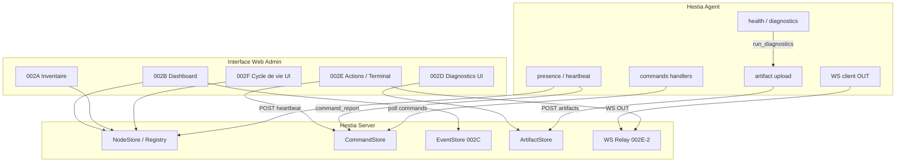

# AUTO-002 — Spécification d’architecture : supervision et administration des nœuds Hestia

| Attribut | Valeur |
|----------|--------|
| **Lot** | AUTO-002 |
| **Nature** | Spécification d’architecture (normative) |
| **Statut** | Ouverture officielle — post AUTO-001 |
| **Implémentation** | Hors périmètre de ce document |
| **Prérequis** | AUTO-001 (A→F) livré — présence, heartbeat, commandes sûres |
| **Alignement** | ADR-018 · ADR-020 · EPIC-011 · Constitution (résilience / souveraineté) |
| **Dépôts concernés** | `hestia`, `hestia-agent`, `hestia-docs` (+ `hestia-installer` pour OPS bootstrap) |
| **Référence amont** | [`AUTO-001-reconnection-autonome-noeud.md`](AUTO-001-reconnection-autonome-noeud.md) |

---

## 1. Vision d’ensemble

### 1.1 Objectif produit

Transformer le mini-PC en **nœud Hestia administré** : un administrateur exploite un parc de nœuds **via le serveur Hestia**, sans SSH nominal, avec SSH réservé à la maintenance exceptionnelle.

AUTO-002 n’est pas un chantier technique isolé : c’est le **module de supervision et d’administration des nœuds**, capitalisant sur le canal Agent ⇄ Serveur déjà établi (heartbeat, ingest, commandes).

### 1.2 Principes hérités d’AUTO-001 (non négociables)

| # | Principe |
|---|----------|
| P1 | **Serveur = autorité** — inventaire, politique, commandes, révocation, cycle de vie. |
| P2 | **Agent = initiateur** — HTTPS sortant uniquement ; aucune connexion entrante obligatoire sur le mini-PC. |
| P3 | **Heartbeat = canal de présence + poll commandes** — pas de nouveau canal descendant obligatoire en V1 AUTO-002. |
| P4 | **Sondes AUTO-001 = télémétrie** — elles alimentent le tableau de bord ; pas de chantier « sondes » séparé. |
| P5 | **SSH = secours** — documenté, jamais le chemin nominal d’administration. |
| P6 | **Agent ≠ application métier** — pas de logique foyer, inventaire équipements métier, règles domotiques. |
| P7 | **HA ≠ logique Hestia** — HA reste moteur local ; Hestia observe et pilote via commandes autorisées. |

### 1.3 Ce qu’AUTO-002 ajoute

| Plan | AUTO-001 | AUTO-002 |
|------|----------|----------|
| Présence | ONLINE / OFFLINE, snapshot | Vue parc, historique, alertes |
| Santé | Sondes dans heartbeat | Synthèse dashboard + diagnostics |
| Pilotage | Commandes sûres (noop, ping, …) | Administration distante structurée |
| Identité | `node_id` provisionné, token global | Token par nœud, révocation, remplacement |
| Interface | API seule | Console admin nœuds (Web) |

### 1.4 Périmètre global

**Inclus :** inventaire nœuds, tableau de bord, observabilité, diagnostics packagés, administration distante via commandes, cycle de vie (enrôlement, remplacement, révocation).

**Exclus (autres EPIC) :** modèle `Equipment` métier (EPIC-002), Hub famille, règles IA, provisioning Installer complet (référencé, pas redéfini ici).

---

## 2. Architecture logique

### 2.1 Composants et responsabilités

```text
┌─────────────────────────────────────────────────────────────────┐
│                    Interface Web Admin (002B)                    │
│         Parc · fiche nœud · actions · diagnostics · logs         │
└───────────────────────────────┬─────────────────────────────────┘
                                │ session admin (HTTPS)
┌───────────────────────────────▼─────────────────────────────────┐
│                      Hestia Server (hestia)                      │
│  002A Inventaire │ 002C Observabilité │ 002D Diagnostics       │
│  002E Admin distante (file commandes, politique, artifacts)      │
│  002F Cycle de vie (enrôlement, révocation, remplacement)      │
└───────────────────────────────┬─────────────────────────────────┘
                                │ HTTPS sortant (Agent initie)
┌───────────────────────────────▼─────────────────────────────────┐
│                    Hestia Agent (hestia-agent)                   │
│  presence · health · commands · diagnostics · ops (hestia-ops)   │
└───────────────┬─────────────────────────────┬───────────────────┘
                │ local                        │ local
         ┌──────▼──────┐                ┌──────▼──────┐
         │  Mosquitto  │                │ Home Assist. │
         └─────────────┘                └─────────────┘
```

### 2.2 Flux de données principaux

| Flux | Direction | Canal | Contenu |
|------|-----------|-------|---------|
| **Présence / santé** | Agent → Serveur | `POST /heartbeat` | Snapshot enrichi (AUTO-001) |
| **Événements** | Agent → Serveur | `POST /ingest/events` | Pipeline L6 (EPIC-001) |
| **Commandes** | Serveur → Agent | réponse `commands[]` heartbeat | Ordres typés + payload |
| **Accusés / résultats** | Agent → Serveur | `command_report` heartbeat | started / finished + artifacts refs |
| **Artefacts volumineux** | Agent → Serveur | `POST /nodes/{id}/artifacts` (002E) | logs, bundles diag (HTTPS sortant) |
| **Session interactive** | bidirectionnel logique | WebSocket **sortant** Agent→Serveur (002E+) | terminal distant chunké |

Le dernier flux est le seul ajout de canal réseau ; il reste **initié par l’Agent** (connexion sortante persistante optionnelle).

### 2.3 Modèle de données serveur (vue d’ensemble)

| Store | Contenu | Lot |
|-------|---------|-----|
| `data/nodes/{id}.json` | Dernier snapshot + métadonnées (existant AUTO-001A) | A |
| `data/node-commands/{id}.json` | Commande active + historique court (extension 002E) | E |
| `data/node-registry/{id}.json` | Profil nœud : labels, site, token hash, état cycle de vie | A, F |
| `data/node-events/{id}/` | Journal présence / transitions (append-only, rotation) | C |
| `data/node-artifacts/{id}/` | Bundles diag, extraits logs (002D/E) | D, E |

---

## 3. Sous-modules

---

### AUTO-002A — Inventaire du nœud

#### Objectif

Maintenir le **registre autoritaire** des nœuds Hestia : identité, métadonnées ops, état de cycle de vie, lien avec le snapshot temps réel.

#### Périmètre

- CRUD admin du registre nœud (hors auto-création sauvage).
- Enrichissement métadonnées : `display_name`, `site`, `tags`, `notes`, `hardware_profile`.
- Corrélation `node_id` ↔ dernier snapshot heartbeat.
- Liste / recherche / filtre parc (ONLINE, OFFLINE, DEGRADED).

**Hors périmètre :** inventaire équipements métier (`hestia_device_id` — EPIC-002).

#### Responsabilités

| Composant | Rôle |
|-----------|------|
| **Serveur** | Source de vérité registre ; refuse nœud non enregistré (cible post-002F). |
| **Agent** | Annonce `node_id` + versions ; ne crée pas de fiche registre riche. |
| **Web Admin** | Liste parc, fiche, édition métadonnées. |
| **Installer** | Écrit `NODE_ID` initial ; pas le registre serveur. |

#### Données échangées

| Entité | Champs clés |
|--------|-------------|
| **NodeRegistry** | `node_id`, `display_name`, `site`, `tags[]`, `lifecycle_state`, `created_at`, `token_id`, `agent_version_expected` |
| **NodeSnapshot** (heartbeat) | hérité AUTO-001 §9 — `services`, `health`, `agent_fsm_state`, … |

#### API concernées (contrat logique)

| Méthode | Chemin | Auth | Effet |
|---------|--------|------|-------|
| `GET` | `/api/v1/admin/nodes` | session admin | Liste parc + statut calculé |
| `GET` | `/api/v1/admin/nodes/{id}` | session admin | Registre + snapshot fusionnés |
| `PATCH` | `/api/v1/admin/nodes/{id}` | session admin | Métadonnées ops |
| `GET` | `/api/v1/nodes/{id}` | Bearer nœud ou admin | *(existant AUTO-001)* |

#### Interactions Agent / Serveur

- Agent : heartbeat avec `node_id` connu.
- Serveur : upsert snapshot ; enrichit vue admin depuis registre + snapshot.

#### Interactions Interface Web

- Page **Parc nœuds** : tableau `node_id`, statut, site, dernière vue, cause, version Agent.
- Fiche nœud : onglet **Identité / Inventaire**.

#### Contraintes de sécurité

- Seul admin authentifié modifie le registre.
- `node_id` immuable après création (révoquer + recréer via 002F).

#### Dépendances

- AUTO-001A (NodeStore), AUTO-001F (commandes).
- AUTO-002F pour enrôlement strict.

---

### AUTO-002B — Tableau de bord

#### Objectif

Fournir la **synthèse opérationnelle** d’un nœud et du parc : point d’entrée unique admin, agrégeant heartbeat, état, santé, sondes, diagnostics récents, commandes et alertes.

#### Périmètre

- Vue **parc** : compteurs ONLINE / OFFLINE / DEGRADED, tri, filtres.
- Vue **fiche nœud** : tuiles présence, santé, services, file sync, dernière commande.
- Timeline récente (présence, commandes, alertes).
- Pas de duplication des sondes : **lecture** du snapshot heartbeat + registre.

**Hors périmètre :** métriques infrastructure VPS ; tableaux de bord famille.

#### Responsabilités

| Composant | Rôle |
|-----------|------|
| **Serveur** | Agrège registre + snapshot + events + commandes ; calcule indicateurs. |
| **Agent** | Continue heartbeat enrichi (AUTO-001) — aucune logique dashboard. |
| **Web Admin** | Rendu ; polling / SSE côté navigateur vers API serveur. |

#### Données échangées

| Vue | Sources |
|-----|---------|
| Statut global | `status`, `agent_fsm_state`, `health.cause`, `degraded_reasons[]` |
| Santé services | `services.{mqtt,ha,ready}`, sondes `health.{mqtt,ha}` |
| Activité | `last_seen`, `uptime_seconds`, `queue_pending`, `presence_attempts` |
| Pilotage | commande courante, historique court |

#### API concernées

| Méthode | Chemin | Auth | Effet |
|---------|--------|------|-------|
| `GET` | `/api/v1/admin/nodes/dashboard` | session admin | Agrégat parc |
| `GET` | `/api/v1/admin/nodes/{id}/dashboard` | session admin | Fiche synthèse |
| `GET` | `/api/v1/admin/nodes/{id}/timeline` | session admin | Événements récents (002C) |

#### Interactions Agent / Serveur

- Aucune API dédiée Agent ; le dashboard **consomme** le heartbeat existant.

#### Interactions Interface Web

- **Page d’accueil admin nœuds** (002B).
- Widgets réutilisables : tuile statut, barre santé, badge cause.

#### Contraintes de sécurité

- Lecture admin only ; pas d’action destructive depuis le dashboard sans passer par 002E.

#### Dépendances

- 002A (inventaire), 002C (events timeline), AUTO-001 snapshot.

---

### AUTO-002C — Observabilité

#### Objectif

Persister et exposer l’**historique observable** du nœud : transitions présence, causes, heartbeats manqués, commandes, alertes — pour audit et corrélation.

#### Périmètre

- Journal append-only des changements significatifs (pas chaque heartbeat).
- Règles d’émission : transition FSM, OFFLINE, DEGRADED, fin commande, alerte seuil.
- Rétention configurable (défaut 30 j).
- Export CSV/JSON admin.

**Hors périmètre :** stack Prometheus/Grafana (option future) ; logs bruts Agent (002D).

#### Responsabilités

| Composant | Rôle |
|-----------|------|
| **Serveur** | Détecte deltas snapshot ; écrit events ; expose API lecture. |
| **Agent** | Émet snapshot ; peut ajouter `observation` optionnelle dans heartbeat si changement local majeur. |
| **Web Admin** | Timeline, filtres, export. |

#### Données échangées

| Event | Exemple `type` | Payload |
|-------|----------------|---------|
| Présence | `presence.online`, `presence.offline`, `presence.degraded` | `cause`, `fsm`, `link` |
| Commande | `command.enqueued`, `command.finished` | `cmd_id`, `type`, `status` |
| Alerte | `alert.heartbeat_missing`, `alert.queue_depth` | seuil, valeur |

#### API concernées

| Méthode | Chemin | Auth | Effet |
|---------|--------|------|-------|
| `GET` | `/api/v1/admin/nodes/{id}/events` | session admin | Liste paginée |
| `GET` | `/api/v1/admin/nodes/events` | session admin | Parc (filtres) |

#### Interactions Agent / Serveur

- Heartbeat → serveur compare avec snapshot précédent → events si delta.
- Optionnel Agent : champ heartbeat `events_local[]` (max N, vocabulaire fermé) pour événements intra-période.

#### Interactions Interface Web

- Timeline fiche nœud ; notifications toast sur alertes actives.

#### Contraintes de sécurité

- Events sans secrets ; pas de token ni payload conf dans le journal.
- Rétention + purge documentée.

#### Dépendances

- AUTO-001D (causes), 002B (affichage).

---

### AUTO-002D — Diagnostics

#### Objectif

Permettre à l’admin de **comprendre et prouver** l’état d’un nœud via diagnostics packagés, sans SSH — en s’appuyant sur `--health`, bundles OPS et remontée d’artefacts.

#### Périmètre

- Déclenchement diag : commande `run_diagnostics` (002E) ou bouton UI.
- Bundle structuré : health texte, état systemd, versions, extrait logs Agent, queue, reachability.
- Stockage serveur + lien téléchargement admin.
- Réutilise `hestia-ops diagnostics` / `--health` Agent — **pas** de scripts arbitraires.

**Hors périmètre :** accès shell libre ; diag HA profond (UI HA reste locale).

#### Responsabilités

| Composant | Rôle |
|-----------|------|
| **Agent** | Exécute diag allowlist ; produit archive ; upload HTTPS sortant. |
| **Serveur** | Enregistre metadata artifact ; sert download admin. |
| **Installer** | Fournit `hestia-ops` / scripts diag — exécutés par Agent, pas par SSH admin. |

#### Données échangées

| Artefact | Format | Contenu |
|----------|--------|---------|
| `diagnostics.bundle` | tar.gz ou json | health, conf redacted, journal excerpt, versions |
| Metadata | JSON | `artifact_id`, `node_id`, `created_at`, `sha256`, `size` |

#### API concernées

| Méthode | Chemin | Auth | Effet |
|---------|--------|------|-------|
| `POST` | `/api/v1/nodes/{id}/commands` | admin | `type=run_diagnostics` |
| `POST` | `/api/v1/nodes/{id}/artifacts` | Bearer nœud | Upload bundle (Agent) |
| `GET` | `/api/v1/admin/nodes/{id}/artifacts` | session admin | Liste |
| `GET` | `/api/v1/admin/nodes/{id}/artifacts/{aid}` | session admin | Téléchargement |

#### Interactions Agent / Serveur

1. Admin enqueue `run_diagnostics`.
2. Agent reçoit via `commands[]`, exécute, upload artifact, `command_report` avec `artifact_id`.
3. Admin télécharge depuis serveur.

#### Interactions Interface Web

- Bouton **Diagnostiquer** ; liste artifacts ; viewer texte (extraits).

#### Contraintes de sécurité

- Redaction secrets (`TOKEN`, mots de passe) avant upload.
- Taille max artifact ; scan type MIME.
- Allowlist commandes diag uniquement.

#### Dépendances

- 002E (commandes), AUTO-001F, `hestia-installer` scripts diag.

---

### AUTO-002E — Administration distante

#### Objectif

Structurer le **pilotage à distance** du nœud via le canal sécurisé existant : commandes typées, file, politique, artifacts — sans SSH entrant.

#### Périmètre

- Extension modèle commande AUTO-001F : file multi-commandes (priorité, file bornée).
- Allowlist versionnée par **classe de risque** (voir §4).
- Types : services, logs, fichiers, maintenance, updates, session interactive.
- WebSocket **sortant** Agent → Serveur pour terminal (002E-2).

**Hors périmètre :** exécution shell libre non allowlist ; port forwarding ; SSH serveur→nœud.

#### Responsabilités

| Composant | Rôle |
|-----------|------|
| **Serveur** | Enqueue, politique, auth admin, audit, stockage artifacts, relais session WS. |
| **Agent** | Poll + exécution idempotente ; handlers par type ; jamais d’initiative destructive. |
| **Web Admin** | Actions guidées ; confirmation pour classe D ; terminal via WS relay. |
| **Installer** | Handlers `update-agent`, `update-ha` via `hestia-ops` — invoqués par Agent. |

#### Données échangées

Héritage AUTO-001 §15 + extensions :

| Extension | Description |
|-----------|-------------|
| `command.priority` | 0..9 (défaut 5) |
| `command.artifact_id` | lien résultat volumineux |
| `command.session_id` | terminal interactif |
| `command.policy_version` | allowlist appliquée |

#### API concernées

| Méthode | Chemin | Auth | Effet |
|---------|--------|------|-------|
| `POST` | `/api/v1/admin/nodes/{id}/commands` | session admin | Enqueue avec audit |
| `GET` | `/api/v1/admin/nodes/{id}/commands` | session admin | Historique |
| `DELETE` | `/api/v1/admin/nodes/{id}/commands/{cid}` | session admin | Annulation si pending |
| `POST` | `/api/v1/nodes/{id}/artifacts` | Bearer nœud | Upload |
| `GET` | `/api/v1/nodes/ws` | Bearer nœud | *(002E-2)* WS sortant Agent |

Réutilisation : `POST /heartbeat`, `command_report` (AUTO-001F).

#### Catalogue de commandes (contrat cible)

| Classe | Types | Exemple |
|--------|-------|---------|
| **A — Lecture** | `ping`, `health_snapshot`, `fetch_logs`, `run_diagnostics` | sans effet de bord |
| **B — Config** | `reload_configuration` | reload conf Agent |
| **C — Services** | `restart_service` | payload `{service:"hestia-agent"}` via systemd/ops |
| **D — Système** | `reboot`, `shutdown` | confirmation admin + délai |
| **E — Maintenance** | `update_agent`, `update_ha`, `hestia_ops` | via `hestia-ops` allowlist |
| **F — Fichiers** | `upload_file`, `download_file` | chemins allowlist |
| **G — Session** | `shell_session` | WS sortant, commandes allowlist interactives |

Chaque type : schéma payload JSON, timeout, idempotence, handler Agent dédié.

#### Interactions Agent / Serveur

```text
Admin → POST command → Serveur (pending)
Agent → heartbeat → commands:[…] → running
Agent → command_report started
Agent → (upload artifact | WS chunks)
Agent → command_report finished
Serveur → event 002C + dashboard 002B
```

#### Interactions Interface Web

- Panneau **Actions** par nœud : boutons mappés types allowlist.
- Modales confirmation classe D/E.
- Terminal web (002E-2) : attaché session WS.

#### Contraintes de sécurité

- Token **par nœud** (002F) avant prod multi-parc.
- Audit log : qui, quand, quelle commande, résultat.
- Rate limit enqueue admin.
- Terminal : allowlist commandes, pas de `rm -rf`, timeout session, enregistrement optionnel.
- Updates : signature / checksum packages (Installer).

#### Dépendances

- AUTO-001F, 002F (auth), 002D (diag), `hestia-installer` hestia-ops.

---

### AUTO-002F — Cycle de vie du nœud

#### Objectif

Gérer le **cycle de vie autoritaire** : enrôlement, activation, suspension, révocation, remplacement matériel — sans auto-regénération Agent.

#### Périmètre

- États : `provisioned` → `active` → `suspended` → `revoked` → `replaced`.
- Émission token par nœud (hash serveur).
- Workflow remplacement : même `node_id`, nouveau secret, révocation ancien token.
- Bootstrap initial : one-shot ou QR (coordination Installer).

**Hors périmètre :** logique métier équipements ; migration données HA.

#### Responsabilités

| Composant | Rôle |
|-----------|------|
| **Serveur** | Crée/révoque tokens ; valide Bearer ↔ `node_id` ; refuse nœud revoked. |
| **Agent** | Porte secret ; ne change jamais `node_id` seul. |
| **Installer** | Première pose ; écrit conf ; consomme bootstrap serveur. |
| **Web Admin** | Wizard enrôlement / remplacement. |

#### Données échangées

| Entité | Champs |
|--------|--------|
| **NodeCredential** | `token_id`, `node_id`, `secret_hash`, `issued_at`, `revoked_at`, `label` |
| **BootstrapToken** | one-shot, TTL court, lié `node_id` pré-créé |

#### API concernées

| Méthode | Chemin | Auth | Effet |
|---------|--------|------|-------|
| `POST` | `/api/v1/admin/nodes` | session admin | Crée nœud + credential |
| `POST` | `/api/v1/admin/nodes/{id}/tokens` | session admin | Rotation secret |
| `POST` | `/api/v1/admin/nodes/{id}/revoke` | session admin | Révoque |
| `POST` | `/api/v1/admin/nodes/{id}/replace` | session admin | Workflow remplacement |
| `POST` | `/api/v1/bootstrap/exchange` | bootstrap token | Obtient credential Agent (Installer) |

#### Interactions Agent / Serveur

- Heartbeat / ingest : Bearer lié à `node_id` du body — rejet si mismatch ou revoked.
- Extension `authorizeNodeForId()` (AUTO-001 hook).

#### Interactions Interface Web

- Wizard **Ajouter un nœud** ; **Remplacer matériel** ; **Révoquer**.

#### Contraintes de sécurité

- Secret affiché une seule fois à l’émission.
- Révocation effective immédiate (cache TTL ≤ 60 s).
- Bootstrap one-shot, IP optionnelle.

#### Dépendances

- 002A (registre), AUTO-001 auth hook, Installer module bootstrap.

---

## 4. Administration distante — architecture détaillée

### 4.1 Choix retenu : commandes + artifacts + WS sortant

| Approche | Verdict |
|----------|---------|
| SSH reverse tunnel admin | Rejeté — complexité, surface sécurité |
| Connexion entrante serveur→nœud | Rejeté — viole P2 |
| **Poll heartbeat + commandes typées** | **Retenu** — AUTO-001F, latence ~HB |
| **Upload artifacts HTTPS sortant** | **Retenu** — logs, diag, fichiers |
| **WebSocket Agent→Serveur** | **Retenu (002E-2)** — terminal interactif |

### 4.2 Terminal distant sécurisé (002E-2)

> **Décision :** [ADR-023](../adr/ADR-023-terminal-distant-websocket-sortant.md) — Accepté.

```text
Agent                          Serveur                         Admin UI
  │                               │                                │
  │── WS connect OUT ────────────►│ hestia-ws-relay                │
  │◄── session_open (cmd) ────────│◄── POST shell_session ─────────│
  │── chunk stdout ──────────────►│── WSS ────────────────────────►│
  │◄── chunk stdin ───────────────│◄── keystroke ──────────────────│
  │── session_close ─────────────►│                                │
```

- Relay dédié `services/ws-relay/` (PHP CLI + bibliothèque WS mature) — **aucune logique métier**.
- API REST = source de vérité (sessions, tickets, audit).
- Agent lance PTY **allowlist** (shell restreint).
- Pas de bind port entrant sur le nœud.
- Session horodatée, auditée, timeout idle.
- Apache proxifie WSS same-origin vers le relay loopback.

### 4.3 Mises à jour

| Cible | Mécanisme | Autorité |
|-------|-----------|----------|
| Agent | commande `update_agent` → `hestia-ops update-agent` | Serveur enqueue ; Installer fournit binaire |
| HA | commande `update_ha` → ops allowlist | Admin explicite ; pas auto |
| OS | hors AUTO-002 V1 | maintenance manuelle exception |

---

## 5. Interactions entre composants (synthèse)



---

## 6. ADR à produire (proposition)

| ADR | Sujet | Moment |
|-----|-------|--------|
| **ADR-021** | Identité et credentials nœud (`node_id`, token, révocation, ≠ `hestia_device_id`) | Avant 002F |
| **ADR-022** | Modèle commandes distantes (classes risque, idempotence, file) | Avant 002E |
| **ADR-023** | Terminal distant sans SSH entrant (WS sortant Agent) — **Accepté** | Avant 002E-2 |
| **ADR-024** | Artefacts et diagnostics (redaction, rétention, taille) | Avant 002D |
| **ADR-025** | Frontière Agent / métier / HA (ce que l’Agent ne fera jamais) | Revue 002 ouverture |

ADR-018 et ADR-020 restent valides ; AUTO-002 les **complète**, ne les remplace pas.

---

## 7. Risques

| Risque | Impact | Mitigation |
|--------|--------|------------|
| Token global encore actif | Compromission parc | 002F prioritaire avant prod multi-nœuds |
| Latence commandes = période HB | Ops perçues lentes | WS pour interactif ; HB immédiat sur enqueue (002E) |
| Dérive « shell libre » | Sécurité, support | Allowlist ADR-022 ; revue types |
| Dashboard = duplication sondes | Dette, incohérence | Une source : snapshot heartbeat |
| Artifacts volumineux | Disque, bande passante | Quotas, compression, rétention |
| Confusion snapshot / vérité métier | Décisions erronées | Glossaire : télémétrie ≠ SoT équipements |
| HA update à distance | Casse domotique locale | Classe E, confirmation, rollback doc |
| Multi-nœuds × events | Charge serveur | Émission delta only ; rotation |

---

## 8. Choix techniques recommandés

| Domaine | Recommandation |
|---------|----------------|
| **Persistance serveur** | Fichiers JSON par nœud (phase actuelle) ; migration SQL si > ~500 nœuds |
| **UI Admin** | Module PWA admin existant ; routes `/admin/nodes/*` |
| **Temps réel UI** | SSE serveur → navigateur ; pas de poll agressif |
| **Commandes** | Étendre AUTO-001F CommandStore ; file max 10/nœud |
| **Handlers Agent** | `lib/commands/` un fichier par type ; tests unitaires |
| **Diagnostics** | Réutiliser `hestia-ops` + `--health` ; archive tar.gz |
| **Auth nœud** | Bearer par nœud ; hook `authorizeNodeForId` |
| **Terminal** | WS sortant (Ratchet/Swoole ou équivalent) ; reconnexion Agent |
| **Logs remontés** | `journalctl -u hestia-agent -n N` allowlist ; pas `/var/log/*` entier |

---

## 9. Feuille de route de développement (proposition)

Ordre : **fondations → visibilité → pilotage → confiance**.

| Phase | Lot | Contenu | Effort relatif | Dépendances |
|-------|-----|---------|----------------|-------------|
| **1** | **002F** | Token par nœud, révocation, bootstrap, hook auth | M | AUTO-001F |
| **1** | **002A** | Registre nœud, métadonnées, API admin liste | S | 002F partiel |
| **2** | **002C** | Events, timeline, alertes heartbeat | S | 002A |
| **2** | **002B** | Dashboard parc + fiche nœud (UI) | M | 002A, 002C |
| **3** | **002E-1** | File commandes, classes A/B/C, audit | M | 002F, AUTO-001F |
| **3** | **002D** | Diagnostics packagés + artifacts | S | 002E-1 |
| **4** | **002E-2** | WS terminal sortant | L | 002E-1, ADR-023 |
| **4** | **002E-3** | Updates Agent/HA, reboot/shutdown (D/E) | M | 002E-1, Installer |
| **4** | **002F+** | Remplacement matériel wizard | S | 002F, 002B |

```text
002F + 002A  →  002C + 002B  →  002E-1 + 002D  →  002E-2/3
     sécurité      visibilité        pilotage sûr      avancé
```

**Critères de clôture AUTO-002 (architecture → validation future) :**

1. Admin gère parc 10+ nœuds sans SSH nominal.
2. Dashboard reflète snapshot heartbeat (< 2× période HB).
3. Diag complet téléchargeable en < 5 min après commande.
4. Token par nœud + révocation opérationnels.
5. Audit trail commandes consultable.
6. Aucune régression AUTO-001 (présence, ingest, commandes sûres).

---

## 10. Lien EPIC-011

| Feature EPIC-011 | Couverture AUTO-002 |
|------------------|---------------------|
| F-037 File offline + dédup | Reste EPIC-001 L6 — observé dashboard (`queue_pending`) |
| F-038 Autorité config VPS | 002F + hors scope sync config maison |
| F-039 Réinstall nœud | 002F bootstrap + Installer |
| F-040 Mises à jour distance | 002E-3 |

AUTO-002 **matérialise** l’administration distante amorcée par EPIC-011 et AUTO-001F.

---

## 11. Références

- [`AUTO-001-reconnection-autonome-noeud.md`](AUTO-001-reconnection-autonome-noeud.md)
- [`AUTO-001-revue-architecture.md`](AUTO-001-revue-architecture.md)
- [`architecture-domotique.md`](architecture-domotique.md) §7, §12
- [EPIC-011](../backlog/EPIC-011.md)
- [ADR-018](../adr/ADR-018-architecture-domotique-agent-passerelle.md)
- [ADR-020](../adr/ADR-020%20-%20Positionnement%20de%20Hestia%20vis-%C3%A0-vis%20de%20Home%20Assistant.md)
- Exécution : [`AUTO-002.md`](../backlog/execution/AUTO-002.md)

---

## 12. Décisions figées (résumé exécutif)

1. AUTO-002 = supervision + admin nœuds ; pas un simple patch technique.
2. Tableau de bord = synthèse heartbeat + registre + events — **pas** de sondes parallèles.
3. Administration distante = extension commandes AUTO-001F + artifacts + WS **sortant**.
4. SSH reste secours ; critère ops = **serveur**, pas SSH.
5. Token par nœud et cycle de vie = prérequis prod parc (002F en tête).
6. Agent reste exécuteur allowlist ; serveur reste autorité et audit.
