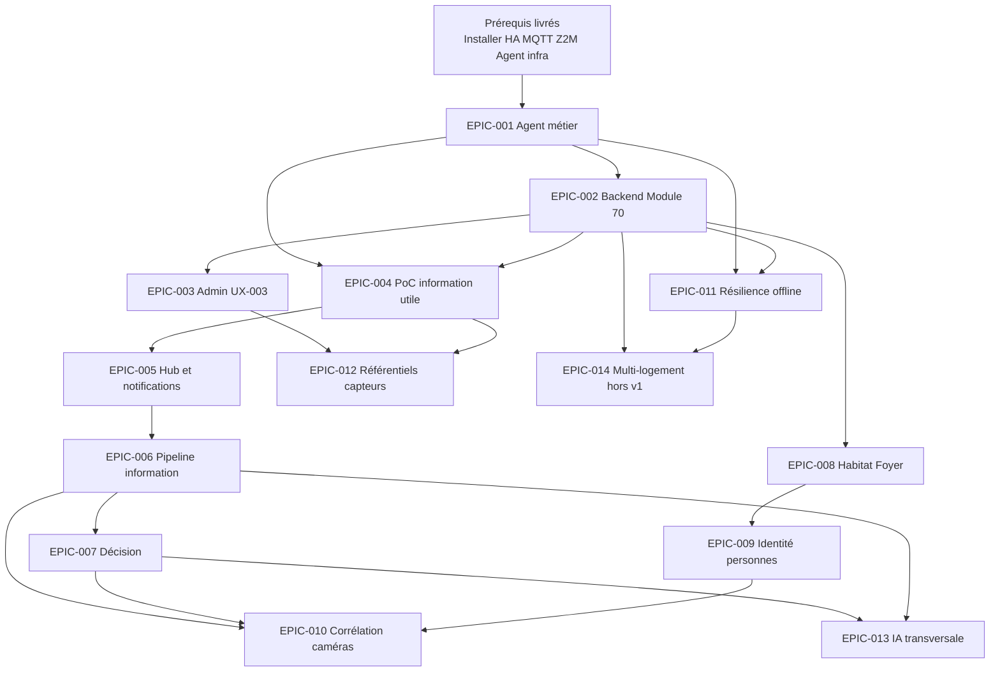

# Graphe des dépendances — Backlog Hestia

## Vue d’ensemble

## Bloquants

| ID | Bloque | Nature |
|----|--------|--------|
| Prérequis nœud | Tout | Sans HA/MQTT/Agent infra, aucune chaîne événement |
| Python 3 (nœud) | EPIC-001 L3+ | Normalisation Agent (`json`/`uuid`) — paquet `python3` via Installer module 20 |
| OpenSSL (nœud) | Mosquitto / INT-001 | Génération secrets MQTT — paquet `openssl` via Installer module 20 |
| EPIC-001 | EPIC-002, 004, 011 | Sans observation/sync Agent, pas de SoT runtime |
| EPIC-002 | EPIC-003, 004, 008 | Sans modèle `Equipment`, pas d’Admin ni PoC métier |
| EPIC-004 | EPIC-005, 006 | PoC valide le chemin avant généralisation |
| EPIC-006 | EPIC-007, 010, 013 | Décision / corrélation / IA portent sur informations utiles |

## Prérequis par Epic

| Epic | Prérequis directs |
|------|-------------------|
| EPIC-001 | Nœud livré (Installer, INT-001, Agent infra) ; **Python 3** (`json`/`uuid`) et **OpenSSL** (secrets MQTT) garantis par Installer module 20 |
| EPIC-002 | EPIC-001 (contrat sync minimal) |
| EPIC-003 | EPIC-002 |
| EPIC-004 | EPIC-001 + EPIC-002 (équipement provisionné ou stub) |
| EPIC-005 | EPIC-004 |
| EPIC-006 | EPIC-005 |
| EPIC-007 | EPIC-006 |
| EPIC-008 | EPIC-002 (localisation équipement) |
| EPIC-009 | EPIC-008 (personnes du foyer) |
| EPIC-010 | EPIC-006 + EPIC-007 ; EPIC-009 pour scénarios intrusion |
| EPIC-011 | EPIC-001 + EPIC-002 |
| EPIC-012 | EPIC-003 ou EPIC-004 |
| EPIC-013 | EPIC-006 + EPIC-007 ; ADR IA à formaliser |
| EPIC-014 | EPIC-002 + EPIC-011 ; décision produit explicite |

## Ordre logique (résumé)

Fondations techniques Agent/Backend → Admin équipements → **valeur utilisateur (PoC)** → Hub → modèles information/décision → contexte habitat/foyer/identité → corrélation → résilience → IA → multi-logement.
