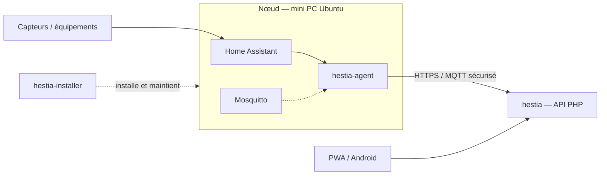

# Écosystème Hestia — document de référence

> **Référence unique** de l'organisation multi-dépôts. Hébergée dans **hestia-docs**.  
> Fondements conceptuels : [Constitution](../constitution/HESTIA%20-%20DOCUMENT%20DE%20RÉFLEXION%20ARCHITECTURALE.md) · [Glossaire](../gouvernance/GLOSSAIRE.md).

*Dernière mise à jour : juillet 2026 (migration hestia-docs).*

---

## 1. Philosophie générale

Les définitions officielles (Hestia ≠ plateforme domotique ; HA vs Serveur vs Agent vs Apps) sont dans la **Constitution** et le **glossaire**. Ce document ne les reformule pas : il cartographie les **dépôts** et leurs responsabilités opérationnelles.

L'écosystème est volontairement scindé en **dépôts GitHub indépendants**, chacun avec une responsabilité claire :

| Principe | Application |
|----------|-------------|
| Séparation des rôles | Serveur applicatif ≠ installation du nœud ≠ runtime Agent |
| Documentation locale | Chaque dépôt applicatif documente **uniquement** son périmètre |
| Documentation transverse | **hestia-docs** (ce dépôt) — constitution, modèles, carte écosystème, ADR transverses |
| Indépendance du code | L'Agent n'appartient pas à l'Installer ; l'Installer le **déploie** seulement |
---

## 2. Architecture de l'écosystème

```text
Hestia (écosystème)
├── hestia-docs
│     Documentation de référence (constitution, modèles, ADR transverses)
│
├── hestia
│     Serveur VPS
│     API
│     Application Web (PWA)
│     Application Android
│
├── hestia-installer
│     Installation et maintenance du nœud Ubuntu
│     Docker
│     Home Assistant
│     Mosquitto
│     Déploiement de l'Agent
│
└── hestia-agent
      Runtime Linux natif
      Processus Agent
      Synchronisation
      Health
      Communication locale
```


---

## 3. Les trois dépôts

| Dépôt | GitHub | Rôle |
|-------|--------|------|
| **hestia-docs** | https://github.com/Drosdov56/hestia-docs | Documentation de **référence** transverse de l'écosystème |
| **hestia** | https://github.com/Drosdov56/hestia | Produit applicatif : API PHP, PWA, conteneur Android, config maître ; documentation **applicative** locale |
| **hestia-installer** | https://github.com/Drosdov56/hestia-installer | Installeur modulaire du **nœud** Ubuntu Server : OS, Docker, Home Assistant, Mosquitto, Zigbee le cas échéant, déploiement et maintenance de l'Agent |
| **hestia-agent** | https://github.com/Drosdov56/hestia-agent | Processus Linux natif sur le nœud : abstraction domotique, sync, health, communication locale — **aucune** logique métier familiale |

### Responsabilités détaillées

#### `hestia-docs` (ce dépôt)

- Constitution, glossaire, modèles conceptuels, vision fonctionnelle
- Carte écosystème, architecture domotique transverse, ADR transverses
- Archive historique non normative

#### `hestia`

- Serveur VPS (`core/` API PHP, `client/` PWA, `android/` WebView)
- Comptes, règles métier, historique, notifications côté serveur
- Documentation **applicative** locale (architecture couches, guides, ADR UI/permissions…)
- Déploiement : `git pull` + `scripts/build.sh` sur le VPS

#### `hestia-installer`

- Scripts d'installation / désinstallation / backup / update / diagnostics du nœud
- Modules ordonnés (préchecks, paquets dont **Python 3** et **OpenSSL**, Docker, Home Assistant, MQTT, Zigbee, **déploiement** de l'Agent, systemd)
- Ne contient **pas** le code source de l'Agent
- Documentation limitée à l'installeur (voir son `docs/`)

#### `hestia-agent`

- Binaire / daemon Linux natif supervisé par systemd
- Couche d'abstraction entre Home Assistant et le serveur Hestia
- Health, configuration, synchronisation, autonomie hors connexion
- **Dépendance runtime :** Python 3 (stdlib `json`, `uuid`) pour la normalisation d’événements (EPIC-001 L3) — **installée et vérifiée** par `hestia-installer` (paquet `python3`, module 20)
- Pas d'auto-mise à jour via GitHub : les mises à jour passent par **hestia-installer**
- Documentation limitée à l'Agent (voir son `docs/`)

### Ce que chaque dépôt n'est pas

| Dépôt | N'est pas |
|-------|-----------|
| `hestia-docs` | Du code produit / installateur / agent |
| `hestia` | L'installeur du mini PC, ni le runtime Agent, ni la SoT documentaire transverse |
| `hestia-installer` | Le code de l'Agent, ni le serveur VPS / la PWA, ni la constitution |
| `hestia-agent` | Un module interne de l'Installer, ni un sous-dossier de `hestia` |
---

## 4. Interactions

| De → Vers | Nature |
|-----------|--------|
| Capteurs → Home Assistant | Protocoles domotiques (Zigbee, etc.) — gérés sur le nœud |
| Home Assistant → `hestia-agent` | Événements / état maison (abstraction) |
| `hestia-agent` → `hestia` (API) | Synchronisation sécurisée (HTTPS / MQTT) vers le VPS |
| Apps (PWA / Android) → `hestia` | Same-origin / API REST — seule UI utilisateurs finaux |
| `hestia-installer` → nœud | Provisionne HA, broker, unit systemd et **installe** les artefacts de `hestia-agent` |

Détail fonctionnel de la passerelle (matériel, corrélation, hors ligne) : [`architecture-domotique.md`](../architecture/architecture-domotique.md).  
Couches applicatives du serveur : dépôt `hestia` → `docs/architecture.md`.
---

## 5. Workflow de développement

| Zone | Dépôt | Pratique |
|------|-------|----------|
| API, PWA, Android, config VPS | `hestia` | Développement local (`scripts/build` + `start-dev`), tests E2E, déploiement VPS |
| Scripts d'install / modules nœud | `hestia-installer` | Itérer sur les modules `install/*.sh` et la doc installer |
| Daemon Agent | `hestia-agent` | Itérer sur le runtime ; valider `--health`, config, signaux |
| Contrat Agent ↔ serveur | `hestia-agent` + `hestia` | Évoluer le protocole / l'API côté serveur sans mélanger les repos |
| Déploiement de l'Agent sur machine | `hestia-installer` | L'Installer consomme / pose l'Agent ; ne pas « fusionner » les deux codes |

Règle : un changement d'architecture **globale** (rôles des dépôts, flux nœud ↔ VPS) se documente d'abord dans **ce fichier**, puis les dépôts satellite mettent à jour uniquement leur doc locale si besoin.

---

## 6. Workflow de déploiement

### Serveur applicatif (VPS)

Cible : https://hestia.serpette.fr — dépôt `hestia`.

```bash
cd /var/www/hestia
git pull
./scripts/build.sh
chown -R www-data:www-data core/public
```

Détail : dépôt `hestia` → `docs/deployment.md`.
### Nœud (mini PC Ubuntu)

1. Cloner et configurer **hestia-installer**
2. Exécuter l'installation (Docker, Home Assistant, Mosquitto, Agent, systemd)
3. L'Agent tourne comme processus natif ; les mises à jour du nœud passent par les scripts de l'Installer

Procédures précises : documentation de [hestia-installer](https://github.com/Drosdov56/hestia-installer).  
Comportement runtime : documentation de [hestia-agent](https://github.com/Drosdov56/hestia-agent).

---

## 7. Où lire quoi

| Besoin | Document / dépôt |
|--------|------------------|
| Écosystème (ce document) | https://github.com/Drosdov56/hestia-docs/blob/main/docs/ecosysteme/ecosysteme.md |
| Constitution | https://github.com/Drosdov56/hestia-docs/tree/main/docs/constitution |
| Glossaire | https://github.com/Drosdov56/hestia-docs/blob/main/docs/gouvernance/GLOSSAIRE.md |
| Architecture domotique (passerelle, HA, Agent) | https://github.com/Drosdov56/hestia-docs/blob/main/docs/architecture/architecture-domotique.md |
| Modèles conceptuels | https://github.com/Drosdov56/hestia-docs/tree/main/docs/modeles |
| Contexte projet applicatif | `hestia` → `docs/CONTEXTE-PROJET.md` |
| Architecture serveur (couches PWA/API/Android) | `hestia` → `docs/architecture.md` |
| Déploiement VPS | `hestia` → `docs/deployment.md` |
| ADR applicatives locales | `hestia` → `docs/adr/`, `docs/produit/registre-adr.md` |
| Installeur nœud | repo `hestia-installer` |
| Runtime Agent | repo `hestia-agent` |

---

## 8. Liens GitHub

- https://github.com/Drosdov56/hestia
- https://github.com/Drosdov56/hestia-installer
- https://github.com/Drosdov56/hestia-agent
- https://github.com/Drosdov56/hestia-docs
